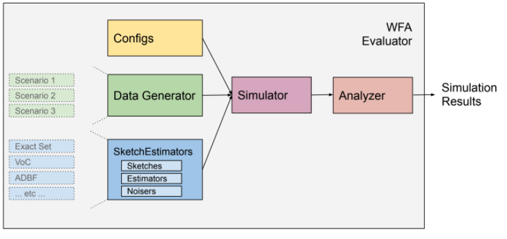

## Frequency Evaluation Framework
Matthew Clegg, Google

6/26/2020

### Objective

Propose changes to the WFA cardinality evaluation framework to enable evaluation of frequency estimators.

### Background

Google and Facebook are developing a cross media open measurement system in accordance with the World Federation of Advertisers.  As part of this effort, research is being conducted into methods for computing cross media reach and frequency in an efficient and differentially private manner.  In the [Cardinality and Frequency Estimation Evaluation Framework](https://github.com/world-federation-of-advertisers/cardinality_estimation_evaluation_framework/blob/master/doc/cardinality_and_frequency_estimation_evaluation_framework.md) document, several promising approaches were identified and criteria proposed for the evaluation and comparison of these approaches.  A [workbench](https://github.com/world-federation-of-advertisers/cardinality_estimation_evaluation_framework) was then developed for the evaluation of cardinality (reach) estimators.  The purpose of this doc is to propose how to extend this effort to include support for evaluation of frequency estimators.

### Requirements

*   Must support each of the scenarios for frequency evaluation envisioned in the [Cardinality and Frequency Estimation Evaluation Framework](https://github.com/world-federation-of-advertisers/cardinality_estimation_evaluation_framework/blob/master/doc/cardinality_and_frequency_estimation_evaluation_framework.md) document.
*   Design should be as similar as possible to the current cardinality estimation framework.
*   Output should be as similar as possible to the output of the current cardinality estimation framework.
*   Should be designed in such a way that it can easily be parallelized to allow for running on various cloud platforms, including Google Cloud.
*   Should support frequency evaluators which are represented as a collection of cardinality sketches, as well as evaluators whose sketches can report frequency directly.

### Out of Scope

*   Implementation of the VoC and ADBF frequency estimation sketches.

### System Diagram

A system diagram of the evaluation framework is given above. This figure applies
both to the existing cardinality estimation framework as well as to the planned
frequency estimation framework. The major components are as follows:

<table>
  <tr>
   <td><strong>Analyzer</strong>
   </td>
   <td>The analyzer analyzes the results of multiple simulation runs and generates charts and tables that summarize the performance of the SketchEstimators that were evaluated. (<a href="https://github.com/world-federation-of-advertisers/cardinality_estimation_evaluation_framework/blob/master/src/evaluations/evaluator.py">code</a>)
   </td>
  </tr>
  <tr>
   <td><strong>Simulator</strong>
   </td>
   <td>The simulator simulates the performance of a sketch when presented with data from a particular evaluation scenario. (<a href="https://github.com/world-federation-of-advertisers/cardinality_estimation_evaluation_framework/blob/master/src/simulations/simulator.py">code</a>)
   </td>
  </tr>
  <tr>
   <td><strong>SketchEstimator</strong>
   </td>
   <td>A SketchEstimator specifies a sketch type, a cardinality or frequency estimation method, and a method for adding differentially private noise. (<a href="https://github.com/world-federation-of-advertisers/cardinality_estimation_evaluation_framework/tree/master/src/estimators">code</a>)
   </td>
  </tr>
  <tr>
   <td><strong>Data Generator</strong>
   </td>
   <td>The data generator creates streams of id's according to a particular evaluation scenario. (<a href="https://github.com/world-federation-of-advertisers/cardinality_estimation_evaluation_framework/blob/master/src/simulations/set_generator.py">code</a>)
   </td>
  </tr>
  <tr>
   <td>
        <strong>Configs</strong>
   </td>
   <td>A config specifies a combination of a data generation scenario and a sketch type. (<a href="https://github.com/world-federation-of-advertisers/cardinality_estimation_evaluation_framework/blob/master/evaluations/data/evaluation_configs.py">code</a>)
   </td>
  </tr>
</table>

### Detailed Design

#### Overview

The overall approach will be to enhance the functionality of the existing code
to support evaluation of multiple frequencies, as opposed to creating a separate
parallel code base for frequency evaluation. As much as possible, changes will
be made so that the existing code continues to work as is, but where
appropriate, there will be alternate code paths for performing
frequency-specific evaluations. The
<code>[ScenarioConfig](https://github.com/world-federation-of-advertisers/cardinality_estimation_evaluation_framework/blob/master/src/evaluations/configs.py)</code>
class will be modified to specify the maximum frequency to be evaluated, with
the default of one so as to match the current behavior.

#### Analyzer

The
[Cardinality and Frequency Estimation Evaluation Framework](https://github.com/world-federation-of-advertisers/cardinality_estimation_evaluation_framework/blob/master/doc/cardinality_and_frequency_estimation_evaluation_framework.md)
doc specifies the following:

*   The accuracy of frequency sketches will be assessed using the shuffle distance.
*   A primary metric will be the number of sketches that can be unioned such that 80% of runs are within 20% shuffle distance.  However, the evaluator will also provide estimates for 90/10 and 95/5 as well.
*   Plots will be provided that compare true and estimated frequency distributions with error bars.

The above requirements will be implemented in the Analyzer.  The following source file changes will be made:

<table>
  <tr>
   <td><code><a href="https://github.com/world-federation-of-advertisers/cardinality_estimation_evaluation_framework/tree/master/src/evaluations/run_evaluation.py">run_evaluation.py</a></code>
   </td>
   <td>Modify to use <code>FrequencyEstimatorEvaluationAnalyzer</code> and <code>FrequencyReportGenerator</code> if <code>max_frequency</code> > 1.
   </td>
  </tr>
  <tr>
   <td><code><a href="https://github.com/world-federation-of-advertisers/cardinality_estimation_evaluation_framework/tree/master/src/evaluations/evaluator.py">evaluator.py</a></code>
   </td>
   <td>Modify <code>run_one_scenario</code> so that it passes <code>max_frequency</code> to the Simulator.
   </td>
  </tr>
  <tr>
   <td><code><a href="https://github.com/world-federation-of-advertisers/cardinality_estimation_evaluation_framework/tree/master/src/evaluations/configs.py">configs.py</a></code>
   </td>
   <td>Modify <code>ScenarioConfig</code> to include <code>max_frequency</code>.
   </td>
  </tr>
  <tr>
   <td><code><a href="https://github.com/world-federation-of-advertisers/cardinality_estimation_evaluation_framework/tree/master/src/evaluations/analyzer.py">analyzer.py</a></code>
   </td>
   <td>Create <code>FrequencyEstimatorEvaluationAnalyzer</code> class similar to <code>CardinalityEstimatorEvaluationAnalyzer</code>.  Create functions to calculate number of sketches that can be unioned and generate plots of true and estimated frequency distributions.
   </td>
  </tr>
  <tr>
   <td><code><a href="https://github.com/world-federation-of-advertisers/cardinality_estimation_evaluation_framework/tree/master/src/evaluations/report_generator.py">report_generator.py</a></code>
   </td>
   <td>Create a <code>FrequencyReportGenerator</code> class for generating reports from frequency comparisons, similar to existing <code>ReportGenerator</code>.
   </td>
  </tr>
</table>

#### Simulator

The
[Simulator](https://github.com/world-federation-of-advertisers/cardinality_estimation_evaluation_framework/blob/master/src/simulations/simulator.py)
currently produces a DataFrame containing four columns: `num_sets`,
`estimated_cardinality, true_cardinality, relative_error`. The simulator will be
modified to produce a DataFrame with `3 * f + 2` columns, where _f_ is the number of
frequencies being evaluated. The columns `estimated_cardinality,
true_cardinality`and`relative_error`will be respectively renamed to
<code>estimated_cardinality_<em>i</em>, true_cardinality_<em>i</em>,</code>
<code>relative_error_<em>i</em></code>, where <em>i</em> is a frequency. The
value of <code>estimated_<em>i</em></code> will be the estimated number of
elements having a frequency of <em>i or higher</em>. Thus,
<code>estimated_cardinality_1</code> will have the same meaning as the current
<code>estimated_cardinality</code>. Similarly, <code>true_cardinality_1</code>
will be the true number of elements having a frequency of <em>i</em> or more.

In addition, a new column will be added named `shuffle_distance`.  Code will be written to compute the shuffle distance and record it in the DataFrame produced by the Simulator.

#### SketchEstimator

The
<code>[EstimatorBase](https://github.com/world-federation-of-advertisers/cardinality_estimation_evaluation_framework/blob/master/src/estimators/base.py)</code>
class will be redefined so that it reports a list of values. If <code>h[]</code>
is the list of values returned by <code>EstimatorBase</code>, then
<code>h[i]</code> is defined as the number of id's that occurred with a
frequency of <em>i+1 or higher</em>. Thus, <code>h[0]</code> is the cardinality
of the set, so this redefinition is almost backward compatible with the current
definition.

There are at least two different types of frequency estimation sketches in
consideration. One type of sketch supports unions and also supports reporting of
frequency histograms for unions. For this type of sketch, frequency estimation
is easy.

Another type of data structure under consideration consists of one cardinality
estimation sketch per frequency. Let's call this a stratified sketch.
Stratification is of interest because it provides a generic mechanism by which
any cardinality estimator can be converted into a frequency estimator. To
calculate the number of elements of frequency _f_ in the union of 2 stratified
sketches requires considering every pair
  
such that
  .
In other words, if if
  .
represents the elements in _X_ having frequency _i_,
then we have
  .

If the sketch supports unions, intersections and set differences, then this
relationship can be used to directly compute a stratified sketch of a union. For
some sketch types, unions are supported but intersections are not. For such
sketches, the cardinality of an intersection can be computed using the [principle
of inclusion-exclusion](https://en.wikipedia.org/wiki/Inclusion%E2%80%93exclusion_principle). This complicates the computation of the frequency
histogram (details supplied on request). The frequency evaluation framework will
provide support for both stratified and unstratified sketches.

To support stratification, a new sketch type will be implemented,
`StratifiedSketch`. A `StratifiedSketch` will be constructed from a list of
cardinality sketch instances. The underlying method used for computing
frequencies will depend upon the capabilities of the sketch instances that are
passed to it. The `StratifiedSketch` will support providing frequency estimates
for unions and intersections. In addition, the `StratifiedSketch` will have a
method for instantiating a new instance from an instance of an `ExactSet`.

#### Data Generator

The
[Cardinality and Frequency Estimation Evaluation Framework](https://github.com/world-federation-of-advertisers/cardinality_estimation_evaluation_framework/blob/master/doc/cardinality_and_frequency_estimation_evaluation_framework.md)
doc foresees three scenarios for the evaluation of frequency estimators:

*   Scenario 1: Homogeneous user activities within a publisher
*   Scenario 2: Heterogeneous user frequency
*   Scenario 3: Publisher Constant Frequency

Each of these will be implemented as subclasses of
<code>[SetGeneratorBase](https://github.com/world-federation-of-advertisers/cardinality_estimation_evaluation_framework/blob/master/src/simulations/set_generator.py)</code>.

#### Configs

A sample config will be created that demonstrates the working of the system with
the
<code>[ExactSet](https://github.com/world-federation-of-advertisers/cardinality_estimation_evaluation_framework/blob/master/src/estimators/exact_set.py)</code>
estimator.

### Thoughts and Issues

#### How will noising be handled?

A single id will only impact a single bar in the frequency histogram, and
deleting that id can change the value of the bar by at most one. Therefore, if
the Laplace mechanism is used to add &epsilon;-differentially private noise to
each bar of the histogram, the result will be &epsilon;-differentially private.

The same considerations apply to the geometric mechanism. Since the existing
implementations of the <code>LaplaceEstimateNoiser</code> and
<code>GeometricEstimateNoiser</code> are able to add noise to a vector of
values, no additional changes need to be made to support adding differential
private noise to a frequency histogram.

#### Can development proceed in parallel?

After the
<code>[EstimatorBase](https://github.com/world-federation-of-advertisers/cardinality_estimation_evaluation_framework/blob/master/src/estimators/base.py)</code>
is updated, it will be possible to implement the VoC and ADBC sketch types in
parallel with the implementation of the remainder of the frequency evaluation
framework. In addition, the
<code>[SetGenerator](https://github.com/world-federation-of-advertisers/cardinality_estimation_evaluation_framework/blob/master/src/simulations/set_generator.py)</code>'s
for the different evaluation scenarios can be implemented in parallel.

#### How will this support parallel computation?

It is not the primary objective of this doc to describe how best to parallelize
this code, so I will just give a few brief comments here. The natural unit of
work is a single simulation run, which is currently handled by the
<code>run_one</code> method of the
[Simulator](https://github.com/world-federation-of-advertisers/cardinality_estimation_evaluation_framework/blob/master/src/simulations/simulator.py)
class. This could be abstracted into its own class, say <code>SimulationTask,
</code>which would encapsulate a Python
[Future](https://docs.python.org/3/library/concurrent.futures.html#concurrent.futures.Future).
A trivial implementation of the <code>SimulationTask</code> would simply perform
the task immediately. A slightly more complex implementation would dispatch
tasks via a thread pool. An even more complex implementation would dispatch
simulation tasks to a pool of workers in a cloud computing environment.

An alternative approach to parallel computation would be to modify the simulator
to use [Apache Beam](https://beam.apache.org/). Apache Beam is a library for
constructing parallel data flow computations. Although originally written in
Java, there are Python bindings. Apache Beam is supported by
[GCP](https://cloud.google.com/dataflow/docs/quickstarts/quickstart-python), and
it has been imported into Google's third party repository. This would require
some refactoring of the existing code so that the computation is formulated as a
data flow graph, but it has the advantage of being able to easily scale to
thousands of nodes.

#### Why not fork a separate code base?

A possible alternative approach would be to fork the cardinality evaluation framework and then implement the frequency evaluation framework in this separate fork.  The advantages of this approach are (1) it reduces the risk of adversely impacting the cardinality evaluation framework, and (2) each fork will likely be somewhat less complex than a combined implementation.  However, this approach has one major drawback, which is that there will now be two similar codebases that have to be maintained in parallel.  This will significantly increase maintenance costs.

As an example of how this can increase maintenance costs, suppose the code is forked and later the decision is made to implement a distributed computation framework for speeding up computations.  If this is to be implemented for both the cardinality estimation fork and the frequency estimation fork, then the cost of implementation may be nearly double the cost of implementing it had there been a single shared code base.  This is but one example of how forking the code base can blow up maintenance costs.

### List of Pull Requests

While the project description has been given top-down, it would be better to implement the changes bottom-up.  The following list of proposed pull requests is given in proposed order of implementation.

<table>
  <tr>
   <td><strong>Size</strong>
   </td>
   <td><strong>Description</strong>
   </td>
  </tr>
  <tr>
   <td>M
   </td>
   <td>Update documentation for <code><a href="https://github.com/world-federation-of-advertisers/cardinality_estimation_evaluation_framework/blob/master/src/estimators/base.py">EstimatorBase</a></code> to return a histogram of estimates (possibly only of length 1).  Update classes deriving from <code>EstimatorBase</code> so that they return a list of values rather than a scalar value.
   </td>
  </tr>
  <tr>
   <td>M
   </td>
   <td>Update <code><a href="https://github.com/world-federation-of-advertisers/cardinality_estimation_evaluation_framework/blob/master/src/estimators/exact_set.py">ExactSet</a></code> to support reporting by frequency and <code><a href="https://github.com/world-federation-of-advertisers/cardinality_estimation_evaluation_framework/blob/master/src/estimators/exact_set.py">LosslessEstimator</a></code> to provide a histogram of values.
   </td>
  </tr>
  <tr>
   <td>M
   </td>
   <td>Implement <code><a href="https://github.com/world-federation-of-advertisers/cardinality_estimation_evaluation_framework/blob/master/src/simulations/set_generator.py">SetGenerator</a></code> for Scenario 1: Homogeneous user activities within a publisher.
   </td>
  </tr>
  <tr>
   <td>M
   </td>
   <td>Implement <code><a href="https://github.com/world-federation-of-advertisers/cardinality_estimation_evaluation_framework/blob/master/src/simulations/set_generator.py">SetGenerator</a></code> for Scenario 2: Heterogeneous user frequency.
   </td>
  </tr>
  <tr>
   <td>M
   </td>
   <td>Implement <code><a href="https://github.com/world-federation-of-advertisers/cardinality_estimation_evaluation_framework/blob/master/src/simulations/set_generator.py">SetGenerator</a></code> for Scenario 3: Publisher Constant Frequency.
   </td>
  </tr>
  <tr>
   <td>3 x L
   </td>
   <td>Create <code>StratifiedSketch.</code>
   </td>
  </tr>
  <tr>
   <td>M
   </td>
   <td>Modify <code><a href="https://github.com/world-federation-of-advertisers/cardinality_estimation_evaluation_framework/blob/master/src/simulations/simulator.py">simulator</a></code> to rename columns in output DataFrame and to add additional columns for higher frequencies.
   </td>
  </tr>
  <tr>
   <td>M
   </td>
   <td>Modify <code><a href="https://github.com/world-federation-of-advertisers/cardinality_estimation_evaluation_framework/blob/master/src/simulations/simulator.py">simulator</a></code> to compute shuffle distance metric and include it in the output DataFrame.
   </td>
  </tr>
  <tr>
   <td>S
   </td>
   <td>Modify <code><a href="https://github.com/world-federation-of-advertisers/cardinality_estimation_evaluation_framework/blob/master/src/evaluations/configs.py">ScenarioConfig</a></code> to include <code>max_frequency</code>
   </td>
  </tr>
  <tr>
   <td>L
   </td>
   <td>Create <code>FrequencyEstimatorEvaluationAnalyzer</code> class similar to <code><a href="https://github.com/world-federation-of-advertisers/cardinality_estimation_evaluation_framework/blob/master/src/evaluations/analyzer.py">CardinalityEstimatorEvaluationAnalyzer</a></code>.  Create functions to calculate number of sketches that can be unioned and generate plots of true and estimated frequency distributions.
   </td>
  </tr>
  <tr>
   <td>L
   </td>
   <td>Create a <code>FrequencyReportGenerator</code> class for generating reports from frequency comparisons, similar to existing <code>ReportGenerator</code>.
   </td>
  </tr>
  <tr>
   <td>S
   </td>
   <td>Modify <code><a href="https://github.com/world-federation-of-advertisers/cardinality_estimation_evaluation_framework/blob/master/src/evaluations/evaluator.py">run_one_scenario</a></code> so that it passes <code>max_frequency</code> to the Simulator.  Modify to use <code>FrequencyEstimatorEvaluationAnalyzer</code> and <code>FrequencyReportGenerator</code> if <code>max_frequency</code> > 1.
   </td>
  </tr>
  <tr>
   <td>M
   </td>
   <td>Implement sample config.
   </td>
  </tr>
</table>

### Links

#### Docs

[Cardinality and Frequency Estimation Evaluation Framework](https://github.com/world-federation-of-advertisers/cardinality_estimation_evaluation_framework/blob/master/doc/cardinality_and_frequency_estimation_evaluation_framework.md)
